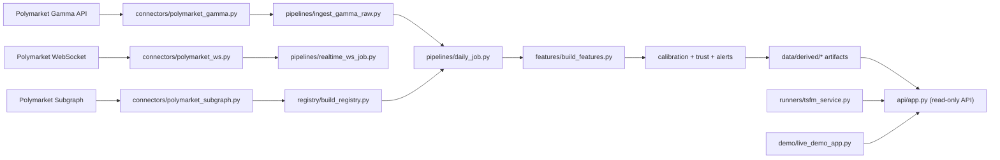

# Market Calibration Agent Architecture Overview

## 1) Scope

This repository implements a market-calibration system for prediction markets with two primary runtime paths:

- PRD1 path: ingest market/event data, compute calibration/trust metrics, generate alerts, publish artifacts.
- PRD2 path: serve probabilistic TSFM forecasts through a hardened service with fallback and observability.

## 2) High-Level System

## 3) Main Components

- Data connectors:
  - `connectors/polymarket_gamma.py`: async HTTP client, pagination, retries, optional rate limiting, snake_case normalization.
  - `connectors/polymarket_subgraph.py`: GraphQL client with retry/backoff and normalized metric rows.
  - `connectors/polymarket_ws.py`: async websocket stream with reconnect/backoff and subscription helpers.
- Pipeline orchestration:
  - `pipelines/daily_job.py`: staged orchestrator (`discover -> ingest -> normalize -> snapshots -> cutoff -> features -> metrics -> publish`) with checkpoint/resume and retry controls.
  - `pipelines/realtime_ws_job.py`: captures ticks, builds 1m/5m bars, writes run metrics.
- Modeling and scoring:
  - `features/build_features.py`: deterministic feature engineering (returns, vol, velocity, OI change, TTE, liquidity bucket).
  - `calibration/*`: calibration metrics, interval metrics, conformal fit/apply, drift trigger logic.
  - `calibration/trust_score.py`: weighted trust-score computation (0-100).
  - `agents/alert_agent.py` + `pipelines/build_alert_feed.py`: rule-based severity and alert feed generation.
- Forecast service:
  - `runners/tsfm_service.py`: TSFM service runtime (adapter call, fallback, cache, circuit breaker, degradation state machine, post-processing, optional conformal last-step adjustment).
  - `runners/tollama_adapter.py`: HTTP adapter for tollama-compatible runtime endpoint.
  - `runners/baselines.py`: EWMA/Kalman/Rolling Quantile fallback bands.
- Serving and UI:
  - `api/app.py`: read-only artifact APIs + `/tsfm/forecast`.
  - `demo/live_demo_app.py`: Streamlit UI for demo/ops views.

## 4) Core Execution Flows

### 4.1 Batch Daily Flow (PRD1)

1. Ingest Gamma markets/events (`pipelines/ingest_gamma_raw.py`).
2. Normalize + snapshot + optional registry enrichment (`pipelines/registry_linker.py`).
3. Build cutoff snapshots (`pipelines/build_cutoff_snapshots.py`).
4. Build feature frame (`pipelines/build_feature_frame.py` -> `features/build_features.py`).
5. Build scoreboard and segment metrics (`pipelines/build_scoreboard_artifacts.py`).
6. Build alert feed (`pipelines/build_alert_feed.py`).
7. Publish outputs + postmortem artifacts (`pipelines/build_postmortem_batch.py` / `reports/postmortem.py`).

### 4.2 Realtime WS Flow (PRD1)

1. Subscribe and stream messages (`connectors/polymarket_ws.py`).
2. Persist deduped ticks (`raw/realtime_ticks/...`).
3. Aggregate deterministic OHLC bars (`pipelines/aggregate_intraday_bars.py`) into 1m and 5m partitions.
4. Persist realtime run metrics (`raw/realtime_run_metrics/...`).

### 4.3 Forecast Flow (PRD2)

1. API receives `POST /tsfm/forecast` (`api/app.py`) and enforces auth + rate limit guard.
2. `TSFMRunnerService.forecast()` validates payload and checks cache.
3. Service attempts tollama inference (`runners/tollama_adapter.py`) if breaker/degradation allows.
4. On failure/guarded conditions, service switches to baseline fallback.
5. Service enforces clipping, quantile monotonicity, interval width sanity, optional conformal last-step output.
6. Service emits Prometheus-style metrics and caches response.

## 5) Data & Storage Contracts

- Raw storage: `raw/<dataset>/dt=YYYY-MM-DD/*.jsonl`.
- Derived storage: `derived/<dataset>/dt=YYYY-MM-DD/*.parquet`.
- PRD1 migration-safe ingest writes both canonical and legacy Gamma raw layouts.
- API store loader (`api/dependencies.py`) reads:
  - scoreboard artifacts from `derived/metrics/scoreboard.json` or partitioned `dt=*/scoreboard.json`
  - alert artifacts from `derived/alerts/alerts.json` or partitioned `dt=*/alerts.json`
  - postmortems from `derived/reports/postmortem/*.md`

## 6) Reliability & Safety Controls

- Pipeline reliability:
  - stage-level retries, recoverable/no-op handling, checkpoint save/load, optional continue-on-failure.
- TSFM runtime reliability:
  - TTL cache + stale-if-error, circuit breaker (closed/open/half-open), degradation modes (`normal`, `degraded`, `baseline-only`).
- Output safety:
  - quantile set/horizon validation, quantile crossing fix, [0,1] clipping, interval min/max clamps.
- API hardening:
  - token-based auth for `/tsfm/forecast`, placeholder-token rejection, per-identity rate limiting.

## 7) Operations & Quality Gates

- CI workflow (`.github/workflows/ci.yml`) runs:
  - lockfile sync check
  - hardening smoke (OpenAPI/auth/rate-limit/perf-smoke)
  - full unit tests + PRD1 acceptance selections
  - PRD2 release gate (`scripts/prd2_verify_all.sh`) with artifacts
- Additional ops scripts:
  - `scripts/prd2_release_audit.py`
  - `scripts/rollout_hardening_gate.sh`
  - `scripts/run_live_demo.sh`

